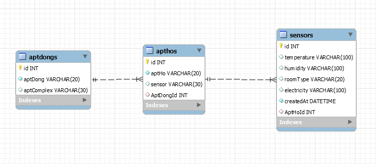

# 아파트 관리 프로그램
[설계](https://www.notion.so/aptmanagement-5d3d046a56444e078a310d1962c5a03c)

# 데이터베이스
## 관계도(ERD)

* apt_dong : apt_ho
    * 1 : N
* apt_ho : sensor
    * 1: N

# REST

# 개선점
* config.json 파일 config.js로 바꾸자