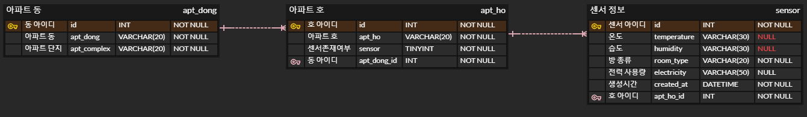

# 아파트 관리 프로그램

# 데이터베이스
## 관계도(ERD)

## 테이블
* aptdongs
    * id : primary key
    * aptDong : 아파트 동수
    * aptComplex : 아파트 단지이름
* apthos
    * id : primary key
    * aptHo : 아파트 호수
    * sensor : 센서 존재 여부(true, false)
    * AptDongId : aptdongs 외래키
* sensors
    * id : primary key
    * temperature : 온도
    * humidity : 습도
    * roomType : 방 종류
    * electricity : 전기 사용량 (한 호당 모두 같게)
    * createdAt : 생성시간
    * AptHoId : apthos 외래키


# 사용법
# 시퀄라이즈
## 시퀄라이즈 타임존 설정
* config/config.json 파일
    * development 안에 timezone을 추가한다.
```json
{
  "development": {
    "username": "유저 이름",
    "password": "디비 비밀번호",
    "database": "디비이름",
    "host": "호스트 IP",
    "dialect": "mysql",
    "timezone": "+09:00"
},
```
## 시퀄라이즈 createAt만 사용하기
* timestamps를 true 한뒤 사용하지 않는 컬럼인 updatedAt을 false로 바꿔준다.
```js
...
{
    sequelize,
    timestamps: true,
    updatedAt: false,
    underscored: false,
    modelName: '모델이름',
    tableName: '테이블이름',
    paranoid: false,
    charset: 'utf8',
    collate: 'utf8_general_ci',
}
```
# 깃 명령어
## branch
* 브랜치 목록을 볼 때
    * git branch
* 브랜치를 생성할 때
    * git branch "브랜치 이름"
* 브랜치를 삭제할 때
    * git branch -d
* 브랜치를 전활할 때
    * git checkout "전환할 브랜치 이름
* 브랜치를 생성후 전환 할 때 
    * git checkout -b "브랜치 이름"
* 원격저장소 브랜치 상태 확인
    * git branch -r
* 로컬저장소 브랜치 상태 확인
    * git branch -a